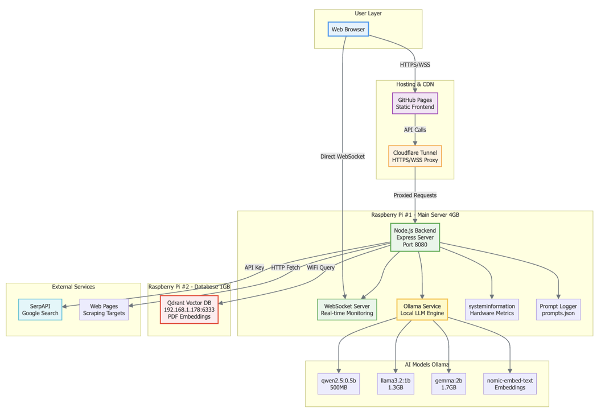

# Local Hosted LLM & RAG on Raspberry Pi — AI Dashboard  
**Course:** COSC 4377 — Computer Networks (University of Houston)  
**Semester:** Fall 2025  
**Instructor:** Omprakash Gnawali  
**Author:** Amrinder Singh (Cougar ID: 2395427)  
**Date:** 2025-11-04  
**Live Demo:** https://amuo007.github.io/my-ai-assistant/

A distributed, fully self-hosted AI web dashboard that runs on Raspberry Pi hardware.  
It supports local LLM chat, smart query routing, PDF semantic Q&A (RAG), live Web-RAG with citations, and real-time Pi monitoring—using a dual-Pi edge architecture.

---

## Hardware Photos & Diagrams

**Hardware image file name (in `frame/` directory):**  
- `IMG_8136.HEIC`

> Note: GitHub may not render `.HEIC` inline. If you want it visible on the README page, export a `.png/.jpg` copy and reference that too.

**System architecture diagram:**  
- `1.png`



---

## Abstract (short)

This project demonstrates that useful conversational assistance, web-augmented question answering, PDF-based semantic retrieval, and real-time device monitoring can be delivered on resource-constrained edge devices. The system uses two Raspberry Pis:  
- **Pi 1 (4 GB):** Node.js backend + WebSockets + Ollama local LLM inference  
- **Pi 2 (1 GB):** Qdrant vector database for embeddings & PDF semantic search  

A static Bootstrap/Chart.js frontend is hosted on GitHub Pages, connected securely to the Pi backend through Cloudflare Tunnel.

---

## Key Features

- **Real-Time System Monitor**
  - CPU, RAM, temperature, uptime streamed every 2 seconds via WebSockets.

- **Normal Local LLM Chat**
  - Direct chat with Ollama models.
  - Streaming tokens via SSE to reduce perceived latency.

- **Smart AI Router**
  - Lightweight classifier decides:
    - **Local LLM** for normal prompts
    - **Web-RAG** for “needs internet/current info” prompts
  - Live status streaming (“searching…”, “generating…”).

- **PDF Question Answering (PDF-RAG)**
  - Upload PDFs → sanitize → chunk → embed → store in Qdrant.
  - Query → embed → top-K cosine similarity chunks → LLM answer with context.
  - Fully offline after indexing.

- **Web Retrieval-Augmented Generation (Web-RAG)**
  - SerpAPI search → scrape pages → chunk + embed → rank → synthesize answer + citations.
  - Streaming final response.

---

## Architecture Overview

### Hardware
- **Raspberry Pi 4 (4 GB) — Backend Node**
  - Runs Node.js Express server
  - Hosts Ollama runtime for inference
  - Maintains WebSocket telemetry streams

- **Raspberry Pi 4 (1 GB) — Vector DB Node**
  - Runs Qdrant for embedding storage and similarity search

### Software Stack
- **Backend:** Node.js + Express + PM2  
- **LLM Runtime:** Ollama (sub-2B models)  
- **Vector DB:** Qdrant  
- **Embeddings:** `nomic-embed-text`, `snowflake-arctic-embed:22m`  
- **Frontend:** Static HTML + Bootstrap + Chart.js + modular JS  
- **Networking:** Cloudflare Tunnel (HTTPS/WSS), GitHub Pages frontend

---

## What’s Inside (modules)

Frontend JavaScript modules:
- `system-stats.js` — System monitor dashboard
- `normal-llm.js` — Direct local LLM chat
- `smart-ai.js` — Smart router chat UI
- `rag-search.js` — Web-RAG UI
- `pdf-rag.js` — PDF Q&A UI

Backend services:
- REST APIs + SSE streams for LLM/RAG
- WebSocket server for hardware telemetry
- Qdrant client for PDF semantic retrieval
- SerpAPI + Cheerio pipeline for Web-RAG

---

## API Endpoints

- `GET /api/system`  
  Returns CPU, RAM, temperature, uptime.

- `POST /api/generate`  
  Direct local LLM generation (SSE streaming).

- `POST /api/chat-smart`  
  Smart routing: local vs web-rag.

- `POST /api/rag`  
  Web-RAG pipeline search → scrape → embed → answer.

- `POST /api/index-pdfs`  
  Chunk + embed PDFs → store to Qdrant.

- `POST /api/ask`  
  PDF semantic retrieval + context-aware generation.

---

## Setup & Deployment

### 1) Backend Pi (4 GB)

1. **Install Node.js (LTS) + dependencies**
   ```bash
   sudo apt update
   sudo apt install -y nodejs npm
   npm install
